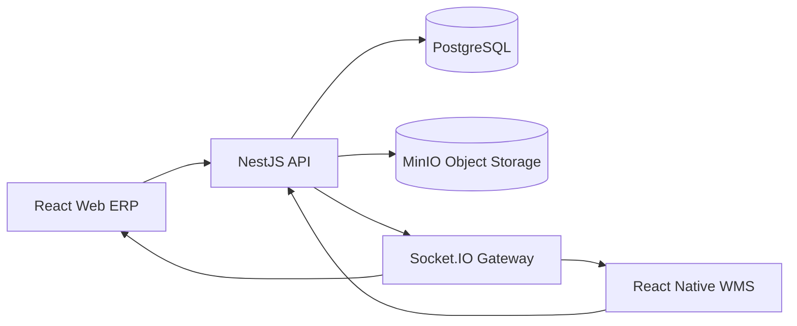

# Al Hayat ERP + Warehouse Management System

## Executive Architecture

Al Hayat Furniture Group needs a fast, auditable ERP and WMS platform for 30 branches, central warehouses, furniture inventory, purchasing, sales, transfers, barcode operations, and management reporting.

The system is structured as a TypeScript monorepo:

- `backend`: NestJS API, PostgreSQL persistence, JWT auth, RBAC, Socket.IO realtime events, MinIO storage integration, Swagger.
- `web`: React + TypeScript enterprise SaaS interface for managers, admins, sales, inventory, and reporting users.
- `mobile`: React Native + TypeScript warehouse app optimized for barcode scanning, receiving, transfers, stock counts, and product lookup.
- `database`: SQL schema, seed data, and migration-ready DDL.
- `docs`: architecture, schema, endpoints, UI architecture, relationships, and folder structure.

## Production Principles

- Strict TypeScript across backend, web, and mobile.
- Modular NestJS domain boundaries.
- DTO validation at every write boundary.
- Repository pattern for data access.
- Explicit RBAC permissions for every protected endpoint.
- Immutable audit logs for critical actions.
- Inventory movements recorded as append-only transactions.
- Realtime events for low stock, transfer status, stock mutations, and receiving updates.
- MinIO object storage for product images, supplier documents, invoices, and receiving attachments.
- Responsive web layout with mobile-first operational flows.
- Warehouse mobile app with large touch targets and scan-first workflows.

## Core Domains

1. Identity and Access
2. Users and Permissions
3. Products and Catalog
4. Warehouses and Locations
5. Inventory and Stock Transactions
6. Branches
7. Transfers
8. Purchasing
9. Sales
10. Notifications
11. Reports
12. Audit Logs
13. Files and Media

## Deployment Topology

## Realtime Event Model

| Event | Trigger | Consumers |
| --- | --- | --- |
| `inventory.stock.updated` | Stock receipt, adjustment, sale, transfer dispatch/receipt | Web dashboard, mobile lookup |
| `inventory.low_stock` | Stock falls below reorder level | Managers, purchasing |
| `transfer.created` | Transfer request submitted | Approvers, warehouse staff |
| `transfer.status_changed` | Approval, dispatch, receipt, cancellation | Branch and warehouse users |
| `purchase.received` | Goods receiving posted | Purchasing and inventory users |
| `notification.created` | Any alertable business event | Web and mobile |

## Security Model

Authentication uses short-lived JWT access tokens and rotating refresh tokens. Refresh tokens are stored server-side as hashes and can be revoked per device/session.

Roles:

- `SUPER_ADMIN`
- `WAREHOUSE_MANAGER`
- `BRANCH_MANAGER`
- `SALES_STAFF`
- `INVENTORY_STAFF`

Permission examples:

- `products.read`, `products.write`
- `inventory.read`, `inventory.adjust`, `inventory.count`
- `transfers.create`, `transfers.approve`, `transfers.dispatch`, `transfers.receive`
- `purchasing.write`, `sales.write`
- `reports.read`
- `users.manage`
- `audit.read`

## Reliability Notes

- Inventory quantities are derived from `inventory_stock` for speed and reconciled against append-only `inventory_transactions`.
- Critical operations run inside database transactions.
- Idempotency keys should be used for mobile scan submissions and receiving operations.
- Audit log writes are part of the same transaction as the business action.
- Reports should query indexed fact tables or materialized reporting views at scale.
- Goods receipts, sales invoices, transfer dispatches, transfer receipts, and stock adjustments write both `inventory_transactions` and `inventory_stock`.
- Stock write paths use transaction-scoped update-then-insert logic to avoid nullable unique-key edge cases in PostgreSQL.
