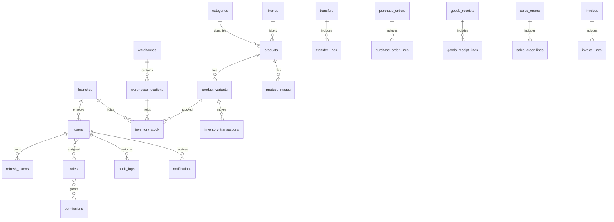

# Database Schema

## Entity Relationship Overview

## Main Tables

| Table | Purpose |
| --- | --- |
| `users` | Employee login identities |
| `roles`, `permissions`, `user_roles`, `role_permissions` | RBAC |
| `branches` | 30 sales and stock branches |
| `warehouses` | Central or regional warehouses |
| `warehouse_locations` | Aisle, rack, shelf, bin structure |
| `products`, `product_variants`, `product_images` | Product catalog and furniture variants |
| `inventory_stock` | Current stock by variant and location |
| `inventory_transactions` | Immutable inventory movement ledger |
| `stock_counts`, `stock_count_lines` | Cycle counts and variance capture |
| `transfers`, `transfer_lines` | Warehouse and branch transfers |
| `suppliers`, `purchase_orders`, `goods_receipts`, `supplier_payments` | Purchasing lifecycle |
| `customers`, `quotations`, `sales_orders`, `invoices` | Sales lifecycle |
| `notifications` | User alerts |
| `audit_logs` | Critical action log |
| `files` | MinIO-backed file metadata |

## Inventory Transaction Types

- `PURCHASE_RECEIPT`
- `SALE_ISSUE`
- `TRANSFER_OUT`
- `TRANSFER_IN`
- `ADJUSTMENT_POSITIVE`
- `ADJUSTMENT_NEGATIVE`
- `STOCK_COUNT_VARIANCE`
- `RETURN_IN`
- `DAMAGE_WRITE_OFF`

## Transfer Statuses

- `DRAFT`
- `PENDING_APPROVAL`
- `APPROVED`
- `REJECTED`
- `DISPATCHED`
- `PARTIALLY_RECEIVED`
- `RECEIVED`
- `CANCELLED`

## Sales Statuses

- `DRAFT`
- `CONFIRMED`
- `INVOICED`
- `PAID`
- `CANCELLED`

## Purchasing Statuses

- `DRAFT`
- `SUBMITTED`
- `APPROVED`
- `PARTIALLY_RECEIVED`
- `RECEIVED`
- `CLOSED`
- `CANCELLED`

