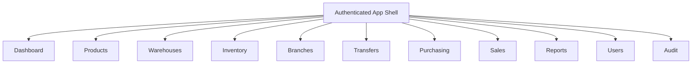

# UI Architecture

## Web ERP

The web ERP is a responsive enterprise SaaS interface using Al Hayat branding:

- Primary: `#0B8F08`
- Secondary Green: `#066006`
- Accent Yellow: `#F3D400`
- Background: `#F7F9F7`
- Text: `#1A1A1A`

## Web Information Architecture

## Web Screens

| Area | Screens |
| --- | --- |
| Auth | Login, Forgot Password, Reset Password |
| Dashboard | KPI cards, low stock alerts, transfer queue, branch summary |
| Products | Product search, product form, variant editor, image gallery, history |
| Warehouses | Warehouse list, location builder, bin detail |
| Inventory | Stock search, transactions, adjustments, stock counts |
| Branches | Branch list, branch inventory, branch performance |
| Transfers | Transfer list, create transfer, approval queue, dispatch, receive |
| Purchasing | Suppliers, POs, PO detail, goods receiving, payments |
| Sales | Customers, quotations, sales orders, invoices |
| Reports | Inventory value, sales, branches, profit, low stock |
| Admin | Users, roles, permissions, audit logs |

## Mobile WMS

The mobile app is scan-first and workflow-focused:

| Screen | Purpose |
| --- | --- |
| Login | JWT authentication |
| Home | Large workflow buttons |
| Scan | Barcode scanner entry point |
| Product Lookup | Product and stock detail |
| Receive Stock | PO receiving by scan |
| Transfer Stock | Scan items into transfer |
| Stock Count | Count bins and submit variance |
| Notifications | Operational alerts |

## Component System

Common web components:

- `AppShell`
- `Sidebar`
- `TopBar`
- `MetricCard`
- `DataTable`
- `StatusBadge`
- `SearchInput`
- `ActionButton`
- `FormField`
- `EmptyState`

Common mobile components:

- `MobileShell`
- `WorkflowTile`
- `ScanInput`
- `StockRow`
- `StatusPill`
- `PrimaryButton`

## Usability Notes

- Web tables prioritize search, filter, sort, pagination, and bulk actions.
- Mobile screens use large targets, direct barcode entry fallback, and offline-friendly idempotency keys.
- Low stock, transfers, and receiving exceptions surface directly in dashboards.
- Cards are used for repeated data groups and KPIs, while operational pages remain dense and scannable.

